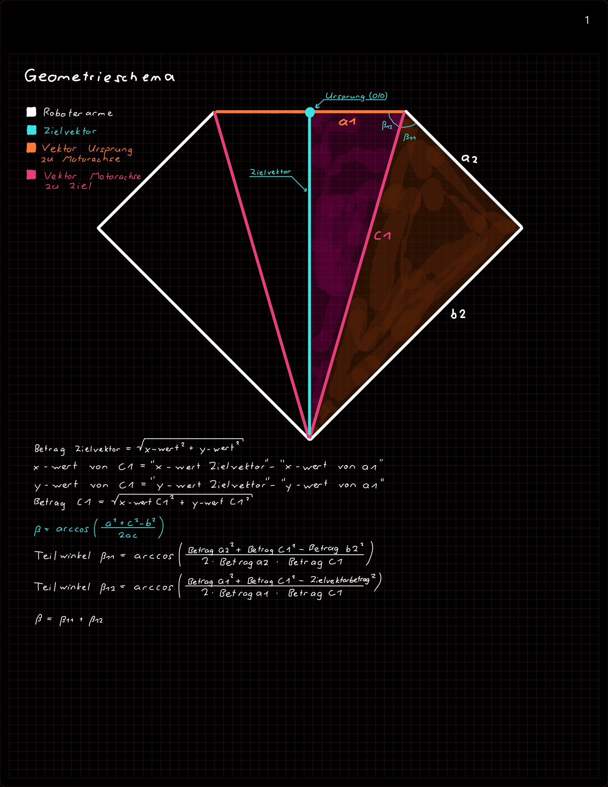
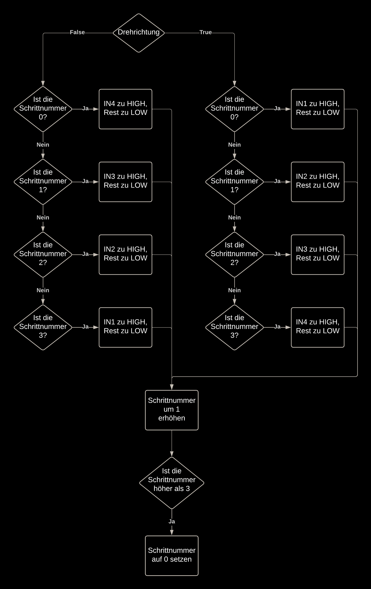
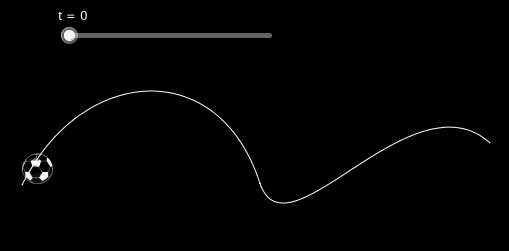
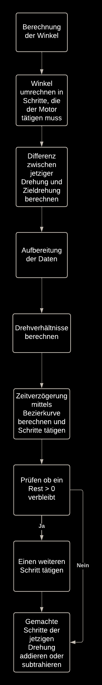

# 2-Achsen-Delta


Der 2-Achsen-Deltaroboter wird ein Programmierprojekt sein, welches einen Deltaroboter per Koordinatensystem von seinem
jetzigen Punkt zu einem beliebigen Punkt bewegt. Dieser Punkt wird mit einer X und einer Y Koordinate definiert.

## Muss Kriterien

Muss Kriterien sind solche, welche zu Projektende erfüllt werden müssen.

### Lösungsansatz (Joel & Armin)

Lösungsansatz zur Realisierung des Projektes

### Hardwareaufbau (Joel)

Der Deltaroboter wird mittels 3D gedruckten Teilen aufgebaut. Die Steuerung der Achsen werden mit einem Arduino
Schrittmotor angesteuert.

### Flussdiagramm (Armin)

Das Flussdiagramm beschreibt den ganzen Programmaufbau, gliedert die Programmteile und macht diese zuteilbar und
übersichtlich. Die exakte Zuteilung wird spontan entschieden.

### Ansteuerung über Numpad (Joel)

Die Positionseingabe wird über ein externes Numpad, welches am Arduino montiert ist, erfolgen.

### Positionierungs- und Ansteuerungs Algorithmus (Armin)

Der Deltaroboter soll von seiner jetzigen Position zu einer beliebigen Position X fahren. Dies sollte unabhängig von
Genauigkeit, Geschwindigkeit, Linearität und Erreichbarkeit sein.

## Wunsch Kriterien

Wunsch Kriterien sind solche, welche zu Projektende nicht erfüllt werden müssen, jedoch wünschenswert wären.

### Linearität

Der Deltaroboter soll linear zwischen zwei Punkten verfahren können. Dies unabhängig von Geschwindigkeit.

### Motion Control

Der Deltaroboter sollte über einen Geschwindigkeitsparameter verfügen, bei welchem die Geschwindigkeit angegeben werden
sollte. Zudem sollte der Roboter am Anfang und Ende jeweils Be- und Entschleunigen.

### Erreichbarkeit

Der Deltaroboter muss merken, wenn eine Position sich ausserhalb seines Arbeitsbereiches befindet und dies Rückmelden.

## Dokumentation

### Verwendung
Hier wird erklärt wie man unseren Code auf einen Arduino laden kann.

Im Voraus wird benötigt:

- [x] Eine IDE, welche `PlatformIO` unterstützt &rarr; zum Beispiel [Microsoft Visual Studio Code](https://code.visualstudio.com/download)
- [x] [`PlatformIO`](https://platformio.org/)
- [x] Einen C++ Compiler wie [GCC](https://code.visualstudio.com/docs/cpp/config-mingw)
- [x] [Arduino IDE](https://www.arduino.cc/en/software) &rarr; Wird benötigt für `PlatformIO`

> [!NOTE]
> Mit **Microsoft Visual Studio Code** kann `PlatformIO` über `Extenstions` heruntergeladen und installiert werden &rarr; [Hier eine Anleitung](https://platformio.org/install/ide?install=vscode)

Den Code laden:

1. Das Repository klonen oder [herunterladen](https://github.com/Arminski99/2-Achsen-Delta/archive/refs/heads/main.zip).
2. Mit **Microsoft Visual Studio Code** oder einer anderen IDE öffnen
3. Den Arduino anschliessen 
4. Mithilfe der Statusleiste das Programm compilen und rüberladen

> [!WARNING]
> Falls ein anderer Arduino oder eine andere Version verwendet wird, muss `plaformio.ini` angepasst werden

<sub> **Von Armin** </sub>

---
### conversionAlg
 
Die Funktion `coversionAlg` berechnet anhand von fixen Längen und einem variablem Vektor die Winkel, welche beide
Motoren haben müssen, um die Zielpositon anzufahren.

Der Vektor (namens Zielvektor) zeigt von Ursprung aus zur Zielposition.

Die Funktion nimmt folgende Parameter:

```cpp
void conversionAlg(float xValue, float yValue, float angles[2], struct ROBOT_DATA &robot)
```

- `xValue, yValue` &rarr; Daten Zielvektor
- `angles[2]` &rarr; Rückgabe der Winkel (angles[0] = Linker Motor, angles[1] = Rechter Motor)
- `ROBOT_DATA` &rarr; Vektordaten des Roboters

Die Funktion arbeitet nach folgendem Schema und Formeln:



> Auf dem Geometrieschema wird nur eine Armseite erklärt, jedoch lässt sich das gleiche Prinzip auf die andere Seite
anwenden.

Der Winkel Beta ist der Motorwinkel.

**Hinweis**

In der Quelldatei wird der Kosinussatz wie folgt umgesetzt:

```cpp
float sectorBeta11 = (acosf((pow(ROBOT.directionVectora2Val, 2)+pow(supportVectorC1, 2)-pow(ROBOT.directionVectorb2Val, 2))/(2 * ROBOT.directionVectora2Val * supportVectorC1)))*180.0f/pi;
```

Dies weicht jedoch von den Berechnungen ab. Dies liegt daran, dass die Funktion `acosf` aus der `math.h` Bibliothek das
Ergebnis im Bogenmass zurückgibt.

Deswegen verwenden wir die Formel $\frac{Resultat\times 180 }{\pi}$ um das Ergebnis in Grad umwandeln.

<sub> **Von Armin** </sub>


---

### conversion

Die Funktion `conversion` ist ein simpler Dreisatz, welcher die Übersetzung des Zahnrads beachtet.

```cpp
//Konvertierung von Grad zu Motorschritten
float conversion(float input, int maxInput, int maxOutput, float translation) {
  return (input / maxInput) * maxOutput * translation;
}
```

Es wird verwendet um die Anzahl von Grad in Schritte umzuwanden.
Da wird in unserem System Zahnräder verwenden (um ein höheres Drehmoment zu erhalten), hat diese Funktion den Parameter
`translation`.

Dieser Parameter gibt den Kehrwert des Verhältnisses der Zahnräder an.

Dies wird wie folgt berechnet: $\frac{1}{Zahnrad(armseitig)/Zahnrad(motorseitig)}$

> [!IMPORTANT]
> Dieser Faktor muss mit dem Ergebnis multipliziert werden, um die richtige Anzahl von Schritten zu erhalten.

<sub> **Von Armin** </sub>

---

### oneStep

Wenn die Funktion `oneStep` ausgeführt wird, tätigt der Motor einen Schritt.

Die Funktion nimmt folgende Parameter:

```cpp
void oneStep(bool direction, struct MOTOR_DATA &motor_data)
```

- `direction` &rarr; Gibt die Drehrichtung des Motors an
- `MOTOR_DATA` &rarr; Relevante Motorparameter (1 InOut wird in dieser Funktion verwendet)

Die Funktion prüft den Zustand von `stepNumber`; eine Variable, welche sich im struct `MOTOR_DATA` des jeweiligen Motors
befindet. Anhand des Zustandes und der Drehrichtung wird der Nächste oder Vorherige Schritt getätigt.

Wenn `IN2` aktiv ist, wird anhand der Drehrichtung entweder `IN1` oder `IN3` aktiviert und der Rest deaktiviert.

Die Funktion wird konkret nach diesem Flussdiagramm abarbeitet:



**Hinweis**

Sobald die Schrittnummer den Wert 4 erreicht hat, muss dieser auf 0 zurückgesetzt werden, da es keinen `IN5` gibt. Der
Schritt nach `IN4` wäre `IN0`.

> Das gleiche giltet für die andere Drehrichtung. Das heisst wenn `IN0` erreicht wird, ist der nächste Schritt `IN4`.

<sub> **Von Armin** </sub>

---

### Zeitverzögerung mit Bezierkurve

In unseren optionalen Kriteriten haben wir definiert, dass unser Roboter be- und entschleunigt.

Um dem gerecht zu werden, haben wir mittels der Bezierkurve eine parametrierbare Zeitverzögerungskurve erstellt.

Die Bezierkurve erlaubt einen gleichmässigen Übergang von einem Punkt zu einem anderen Punkt.

Mit den **Anfangs-, End- und Kontrollpunkten** kann die Kurve definiert werden.

> Je mehr **Kontrollpunkte**, umso feiner kann die Kurve abgestimmt werden

Wir verwenden eine Bezierkurve mit 3 Kontrollpunkten (5 Punkten insgesamt)

Die Berechnung unserer Zeitverzögerung findet wie folgt statt:

$B(t)=(1-t)^4\times P_{0}+4\times (1-t)^3\times t\times P_{1}+6\times(1-t)^2\times t^2\times P_{2}+4\times (1-t)\times t^3\times P_{3}+t^4\times P_{4}$

Umsetung in der Quelldatei:

```cpp
float delayTime = (pow((1 - t), 4) * destination.timeDelayP0 + 4 * pow((1 - t), 3) * t * destination.timeDelayP1 + 6 * pow((1 - t), 2) * pow(t, 2) * destination.timeDelayP2 + 4 * (1 - t) * pow(t, 3) * destination.timeDelayP3 + pow(t, 4) * destination.timeDelayP4) * scaleFactor;
```

Der Faktor `t` ist ein **normierter Wert** zwischen 0 und 1 und bestimmt wie weit der Kurve entlang man sich befindet.

**Ein paar Beispiele:**

- `t` = 0.0 &rarr; Zeitvertögerung am Anfgangspunkt $P_{0}$
- `t` = 1.0 &rarr; Zeitvertögerung am Endpunkt $P_{4}$
- `t` = 0.5 &rarr; Zeitvertögerung zur Hälfte (Punkt $P_{2}$)
- `t` = 0.75 &rarr; Zeitvertögerung zu drei viertel der Strecke (Punkt $P_{3}$)

#### **Eine Visualisierung des Faktor `t`:**



[Bildquelle](https://www.google.com/url?sa=i&url=https%3A%2F%2Fdms.nuw.rptu.de%2Fgeogebrainstitut%2Findex.php%2F2_-_Die_Herren_Bezier_und_de_Casteljau_und_ihre_Kurven&psig=AOvVaw0AGS1Ln5fCpACpi3CaemQN&ust=1735678948798000&source=images&cd=vfe&opi=89978449&ved=0CBMQjRxqFwoTCIjB6Iqy0IoDFQAAAAAdAAAAABAE)

#### **Normierung des Faktor `t`:**

Der Faktor `t` muss zwischen 0 und der maximalen Anzahl von Schritten normiert werden.

> Das heisst beim 0-ten Schritt muss `t = 0.0` und bei der maximalen Anzahl Schritten `t = 1.0` betragen. Dazwischen
> muss ein gleichmässiger Verlauf stattfinden!

Um dies zu erreichen verwenden wir folgende Formel um `t` zu normieren:

$t =\frac{i}{maxSteps-1}$

- *i* &rarr; Der aktuelle Schritt
- *maxSteps* &rarr; Die maximale Anzahl Schritte

#### **Skalierungsfaktor für die Zeitverzögerung:**

Damit der Roboter die Zielposition zu einer bestimmten Zeit erreicht (z.B: 10s) muss bei jeder Zeitverzögerung ein
Skalierungsfaktor angewendet werden, um dies zu erreichen.

Zuerst muss die durchschnittliche Zeitverzögerung für die gesamte Bewegungszeit berechnet werden:

$DurchschnittlicheZeitverzögerung = \frac{Bewegungszeit}{MaximaleAnzahlSchritte}$

> Im Quellcode wird hier noch mit 1000 multipliziert. Dies wird gemacht um von Sekunden auf Millisekunden umzurechnen

Zudem auch die durchschnittliche Zeitverzögerung der Bezierpunkte:

$DurchschnittlicheZeitverzögerungBezierpunkte = \frac{P_{0}+P_{1}+P_{2}+P_{3}+P_{4}}{5}$

Danach kann der Skalierungsfaktor durch das bilden des Verhältnisses berechnet werden:

$Skalierungsfaktor = \frac{DurchschnittlicheZeitverzögerung}{DurchschnittlicheZeitverzögerungBezierpunkte}$

In der Quelldatei wie folgt notiert:

```cpp
//Zeitverzögerung fuer insgesamte Bewegungszeit berechnen
float averageTimeDelay = (destination.travelTime / maxSteps) * 1000.0f;

//Durchschnittliche Zeitverzögerung für die Bezierkurve berechnen
float originalAverageDelay = (destination.timeDelayP0 + destination.timeDelayP1 + destination.timeDelayP2 + destination.timeDelayP3 + destination.timeDelayP4) / 5.0f;

//Skalierungsfaktor ist das Verhältnis zwischen
float scaleFactor = averageTimeDelay / originalAverageDelay;

```

#### **Schutzmechanismus:**

Falls der Skalierungsfaktor kleiner als 1 ist, kann es dazu kommen, dass die Zeitverzögerung unter 2ms liegt.

> [!IMPORTANT]
> Die Zeitverzögerung muss mindestens 2ms zwischen jedem Schritt betragen, sodass der Motor richtig funktionieren kann.
> Dies liegt in der Natur des Motors.

Um dies zu verhinden, wird im Programm geprüft ob dieser unter 1 liegt. Falls dies der Fall ist, wird der
Skalierungsfaktor auf 1 gesetzt.

```cpp
//Schutzmechanismus
if (scaleFactor < 1.0f) {
    scaleFactor = 1.0f;
}
```

> [!NOTE]
> Mit der Datei [`olc_stuff.exe`](./programs/olc_stuff.exe) lässt sich eine beliebige Bezierkurve visuell darstellen. Diese wurde von [confrontal](https://github.com/confrontal) zur Verfügung gestellt.

<sub> **Von Armin** </sub>

---

### moveL

Die Funktion `moveL` steuert beide Motoren an, um von der jetzigen Position linear zur Zielposition zu fahren.

moveL verwendet folgende Funktionen & Methoden:

- converstionAlg
- convert
- oneStep
- Zeitverzögerung mit Bezier Kurve

> [!IMPORTANT]
> Bitte diese Kapitel zuerst lesen!

Die Funktion nimmt folgende Parameter:

```cpp
int moveL(struct DESTINATION_DATA destination, struct MOTOR_DATA &motor_data_right, struct MOTOR_DATA &motor_data_left, struct ROBOT_DATA &robot, bool debugMode)
```

- `struct destination` &rarr; Beinhaltet Zielkoordinaten, Ausführungszeit, Be- und Entschleunigungsdaten
- `struct motor_data_right & motor_data_left` &rarr; Beinhaltet alle benötigten Motorvariablen pro Motor
- `struct robot` &rarr; Beinhaltet alle nicht-ändernden Vektor und Längendaten
- `bool debugMode` &rarr; Wenn dieser Parameter auf `TRUE` gesetz wird, werden alle berechneten Werte im Serial Monitor
  ausgegeben

> [!NOTE]
> Die Motordatenstructs beinhalten jeweils 2 InOuts: `stepNumber` und `currentPosition`. Auf beide Variablen wird
> jeweils zurückgeschrieben.

Die Funktion arbeitet nach folgendem Flussdiagramm:



#### **Berechnung der Winkel:**

Zu Beginn werden mittels der Funktion `conversionAlg` die Winkel, welche die Motoren einnehmen müssen, berechnet.

Die Winkel werden in folgendem Array abgespeichert:

```cpp
float angles[2];
```

> Das erste Element im Array referenziert auf den linken Motor. Das zweite Element auf den rechten.

#### Schutzmechanismus:

Falls die Zielpostition rein geometrisch nicht erreichbar ist, geht die Berechnung in der Funktion `conversionAlg` nicht
auf. Daraus resultiert, dass der Wert bzw. Datentyp `NaN` (Not a Number) zurückgegeben wird.

> Eine Variable mit dem Wert `NaN` ist ungleich sich selber. Das liegt daran, dass der Typ `NaN` nicht vergleichbar ist.

Aufgrund von dem kann mit folgender Funktion vor diesem Fall geschüzt werden:

```cpp
//Falls Zielposition nicht erreichbar ist, abbrechen
if (angles[0] != angles[0] || angles[1] != angles[1]) {
    if (debugMode == true) {
        Serial.print("Position ist nicht erreichbar!");
    }
    return 1;
}
```

Falls dieser Fall eintrifft, kann an diesem Punkt die Funktion gestoppt werden und der Wert `1` (Ausführung erfolgreich
fehlgeschlagen) zurückgegeben werden.

#### **Winkel umrechnen in Schritte:**

Die Winkel können nun mit Hilfe der Funktion `conversion` in Anzahl Schritten umgerechnet werden.

Diese werden im folgenden Array gesichert:

```cpp
float anglesInSteps[2];
```

#### **Drehung berechnen:**

Nun kann berechnet werden, um wieviel der jeweilige Motor drehen muss:

$AnzahlDrehungen = AktuelleMotorposition - AbsoluteZielposition$

> [!NOTE]
> Die aktuelle Motorposition wird im `struct motor_data_right & motor_data_left` gespeichert.

#### **Aufbereitung der Drehdaten:**

Zuerst die Drehrichtungsparameter erstellen, um diese später in der Funktion `oneStep` verwenden zu können:

```cpp
//Drehrichtungparameter erstellen
bool turnDirectionMotorLeft;
bool turnDirectionMotorRight;
```

Die Aufbereitung der Daten findet wie folgt statt:

Falls der **linke Motor** eine negative Anzahl Drehungen hat, muss der Motor im Gegenuhrzeigersinn drehen. Deswegen muss
die Variable `turnDirectionMotorLeft` auf `TRUE` gesetzt werden. Zudem muss der Wert mit `-1` multipliziert werden, da
ich in einer `FOR-Schlaufe` mit positiven Werten zu arbeiten wünsche.

Falls eine positive Anzahl Drehungen gegeben ist, muss der Motor im Uhrzeigersinn drehen.

Die Aufbereitung ist in der Quelldatei wie folgt umgesetzt:

```cpp
//Daten aufbereiten Motor Links
if (turnMotorSteps[0] < 0) {
    turnDirectionMotorLeft = true;
    turnMotorSteps[0] = turnMotorSteps[0] * -1;
} else {
    turnDirectionMotorLeft = false;
}
```

> [!IMPORTANT]
> Wenn der Motor sich im Uhrzeigersinn dreht, bewegt sich der Roboterarm aufgrund unseres Zahnradsystems im
> Gegenuhrzeigersinn.

> [!IMPORTANT]
> Die Datenaufbereitung ist für den rechten Arm **spiegelverkehrt**, da dieser an der Y-Achse
> gespiegelt ist.

#### Schutzmechanismus

Prüfen ob überhaupt Schritte getätigt werden müssen

```cpp
//Falls keine Schritte getaetigt werden muessen ist die Zielposition schon erreicht
if (turnMotorSteps[0] <= 0 && turnMotorSteps[1] <= 0) {
    return 0;
}
```

#### **Drehverhältnisse berechnen:**

Um den Motor linear zu verfahren muss man zuerst folgendes Prinzip, welches ich mittels eines **Beispieles** erklären
werde, verstehen:

Wenn der linke Motor 100 Umdrehungen und der rechte 10 tätigen muss, so muss der rechte 1 Umdrehung für alle 10
Umdrehungen des rechten tätigen.

> Das Gleiche ist anwendbar, wenn der rechte Motor mehr und der linke weniger tätigen muss.

**Wie dieses Prinzip in unserem Programm umgesetzt wird:**

Zuerst prüfen wir, ob der linke oder rechte Motor mehr Schritte tätigen muss und speichern diesen Wert als `maxSteps`
ab:

```cpp
//maxSteps auswerten
if (turnMotorSteps[1] > turnMotorSteps[0]) {
    maxSteps = turnMotorSteps[1];
    stepsRightBigger = true;
} else {
    maxSteps = turnMotorSteps[0];
}
```

> [!NOTE]
> Hier wird hier die Variable `stepsRightBigger` beschrieben. Diese ist nur relevant für die Bezierkurve, jedoch wird
> dies getätigt, da es Effizienter ist. Ansonsten müsste in der `FOR-Schlaufe` jedes mal eine Abfrage getätigt werden.

Danach kann das Prinzip angewendet werden:

Wir bilden hier das Verhältnis zwischen den Anzahl Schritten für rechts und links und den maximal zu tätigenden
Schritten.

$VerhältnisZuTotalLinks = \frac{SchritteLinks}{MaximaleAnzahlSchritte}$

$VerhältnisZuTotalRechts = \frac{SchritteRechts}{MaximaleAnzahlSchritte}$

Umsetzung in der Quelldatei:

```cpp
//Verhältnis zwischen den Schritten und der Anzahl maximalen Schritten
float ratioToTotalLeft = turnMotorSteps[0] / maxSteps; 
float ratioToTotalRight = turnMotorSteps[1] / maxSteps;
```

> `turnMotorSteps[0]` referenziert zum linken Motor, `turnMotorSteps[1]` referenziert zum rechten Motor.

Wir verwenden nun zwei **Akkumulatorvariablen**. Mit diesen wird das am Anfang besprochene Prinzip umgesetzt wie folgt
umgesetzt:

1. Beide **Akkumolatorvarablen** werden auf `0.0f` gesetzt.
2. Das Verhältnis wird bei jedem Durchlauf der `FOR-Schlaufe` addiert.
3. Sobald die **Akkumulatorvariable** den Wert `1.0f` erreicht, wird ein Schritt des jeweiligen Motors getätigt, und der
   Wert der Variable wird um `1.0f` dekrementiert.

Die Umsetzung in der Quelldatei wird wie folgt bewerkstelligt:

```cpp
//For-Schleife zum machen der Schritte (Limit --> Maximale Anzahl Schritte)
for (int i = 0; i < maxSteps; i++) {

    //Das Verhältnis zur Akkumulatorvariable addieren
    leftAccumulator += ratioToTotalLeft;
    rightAccumulator += ratioToTotalRight;

    //Sobald diese erreicht ist, einen Schritt tätigen, dabei die Variable zurücksetzen und einen Schritt tätigen
    if (leftAccumulator >= 1.0f){
        oneStep(turnDirectionMotorLeft, motor_data_left);
        leftAccumulator -= 1.0f;
        numberStepsLeft++;
    }
    if (rightAccumulator >= 1.0f){
        oneStep(turnDirectionMotorRight, motor_data_right);
        rightAccumulator -= 1.0f;
        numberStepsRight++;
    }

    //Zeitverzögerung verwenden
    delay((int)delayTime);
}
```

> Am Ende wird hier dann noch die Zeitverzögerung angewandt.

> [!IMPORTANT]
> In den `IF-Schlaufen` wird bewusst um den Wert `1.0f` dekrementiert und nicht die **Akkumulatorvariable**
> auf `0.0f` gesetzt. Dies wird getätigt, da eventuell das Verhältnis nicht durch `1.0f` teilbar ist und somit ein Rest
> entstehen kann.

> [!NOTE]
> `numberStepsLeft` und `numberStepsRight` wird später verwendet, um die aktuelle Position anzupassen.

#### **Auf Rest prüfen:**

Nach der `FOR-Schlaufe` kann (wie oben schon beschrieben) sein, dass eventuell ein Rest in der **Akkumulatorvariable**
vorhanden sein kann. Um dies zu berücksichtigen, wird noch ein Schritt getätigt, falls die **Akkumulatorvariable** einen
Wert grösser als `0.5f` hat.

```cpp
//Rest nachkorrigieren
if (rightAccumulator > 0.5f) {
    oneStep(turnDirectionMotorLeft, motor_data_left);
    numberStepsLeft++;
}

if (leftAccumulator > 0.5f) {
    oneStep(turnDirectionMotorRight, motor_data_right);
    numberStepsRight++;
}
```

> [!TIP]
> Der Wert zum Nachkorrigieren (Hier `0.5f`), kann angepasst werden, um eventuell bessere Resultate zu erhalten.

#### **Position anpassen:**

Am Ende der `moveL` Funktion muss die **aktuelle Position** noch angepasst werden. Für dies verwenden wir die Variable
`numberStepsRight`, welche beim Tätigen eines Schrittes um 1 inkrementiert wurde.

Die Umsetung in der Quelldatei wird wie folgt bewerkstelligt:

```cpp
//Position anpassen
if (turnDirectionMotorLeft == true) {
    motor_data_left.currentPosition += numberStepsLeft;
} else {
    motor_data_left.currentPosition -= numberStepsLeft;
}

if (turnDirectionMotorRight == true) {
    motor_data_right.currentPosition -= numberStepsRight;
} else {
    motor_data_right.currentPosition += numberStepsRight;
}
```

Falls der links Motor um Uhrzeigersinn gedreht wird, so müssen die neuen Schritte zur Position addiert werden, ansonsten
müssen sie subtrahiert werden.

> [!IMPORTANT]
> Die Positionsanpassung ist für den rechten Arm **spiegelverkehrt**, da dieser an der Y-Achse gespiegelt
> ist.

> [!IMPORTANT]
> Wenn der Motor sich im Uhrzeigersinn dreht, bewegt sich der Roboterarm aufgrund unseres
> Zahnradsystems im Gegenuhrzeigersinn. Grunddessen müssen **Additionen** und **Subtraktionen** vertauscht werden.

Falls das Programm bis hier überlebt hat, kann die Aktion erfolgreich beendet werden:

```cpp
//Aktion erfolgreich
return 0;
```

---

### **Keypad**

Für das Keypad wurde die Bibliothek  `<Keypad.h>` verwendet. 

Oben im Code muss dafür einiges deklariert werden.

- Anzahl Zeilen & Spalten
- Die Matrix mit den Zeichen
- Die Pins an dem Arduino

In diesem Fall ein 4x4 Keypad mit folgender Belegung:

```cpp
const byte ROWS = 4;
const byte COLS = 4;

char hexaKeys[ROWS][COLS] = {
  {'1', '2', '3', 'A'},
  {'4', '5', '6', 'B'},
  {'7', '8', '9', 'C'},
  {'*', '0', '#', 'D'}
};

byte rowPins[ROWS] = {37, 36, 35, 34};
byte colPins[COLS] = {33, 32, 31, 30};

Keypad customKeypad = Keypad(makeKeymap(hexaKeys), rowPins, colPins, ROWS, COLS);
```

<sub> **Von Joel** </sub>

---
### **Positionierung**

Die Variable `GettingX` oder `GettingY` wird `TRUE`, wenn man mit dem Keypad A oder B auswählt.

- `A` &rarr; X-Koordinate
- `B` &rarr; Y-Koordinate

```cpp
// A und B für X und Y setzen
if (customKey == 'A') {
  GettingX = true;
  GettingY = false;
  u = 0;
  Serial.println("Getting X Coordinates...");
} else if (customKey == 'B') {
  GettingX = false;
  GettingY = true;
  u = 0;
  Serial.println("Getting Y Coordinates...");
}
```

Wird zum Beispiel `X` ausgewählt, so ist die `WHILE-Schlaufe` so lange aktiv, bis eine Eingabe getätigt wird. 

Dieser Vorgang wird widerholt, da die Eingabe 2 stellig sein muss. 

> [!CAUTION]
> Für die Position 5 **muss** `05` eingegeben werden.

Beide Zahlen werden in das Array `BothX[]` geschriben. Die Zehner mit dem Index `[0]` und die Einer mit dem Index `[1]`.

```cpp
if (GettingX) {
    for (u = 0; u < 2; u++) {
      char key = NO_KEY;
      while (key == NO_KEY) {
        key = customKeypad.getKey();
      }

      if (key) {
        BothX[u] = key;
      }
    }
}
```
> `NO_KEY` ist aktiv, wenn nichts gedrückt wird.

```cpp
 PosArray[0] = (BothX[0] - '0') * 10 + (BothX[1] - '0') -10;
```
Hier werden die Zahlen zu einer Zahl zusammen gerechnet

- `[0]` der Zehner, wird mit 10 Multipliziert
- `[1]` der Einer, wird dazu addiert
- Die `-10` verschiebt den Nullpunkt nach links, da die Eingabe mit Positiven Werten erfolgen soll.

Der Wert wird dann auf die Positionsvariable `PosArray[]` geschriben. `X` mit dem Index `[0]` und `Y` mit dem Index `[1]`

Die Zahlen im Array werden dann noch in die `moveL` Funktion eingefügt.

Mit der Taste `#` wird die eingegebene Position angefahren:

```cpp
if (customKey == '#') {

      DESTINATION.xValue = PosArray[0];
      DESTINATION.yValue = PosArray[1];
      moveL(DESTINATION, MOTOR_RIGHT, MOTOR_LEFT, ROBOT, true);

  }
```

<sub> **Von Joel** </sub>

---

### **Arduino Mega**

Im Verlauf des Projekts mussten wir feststellen, dass die digitalen Pins am Arduino nicht ausreichen.

**Jeweilige Pin Anzahl:**

- Benötigt: `16 DI/DO`
- Arduino Uno: `14 DI/DO`
- Arduino Mega: `50 DI/DO`


Deshalb haben wir auf einen Arduino Mega gewechselt.

> [!NOTE]
> Wir benötigen `8 DI/DO` für die 2 Motoren und `8 DI/DO` für das Keypad

<sub> **Von Joel** </sub>
